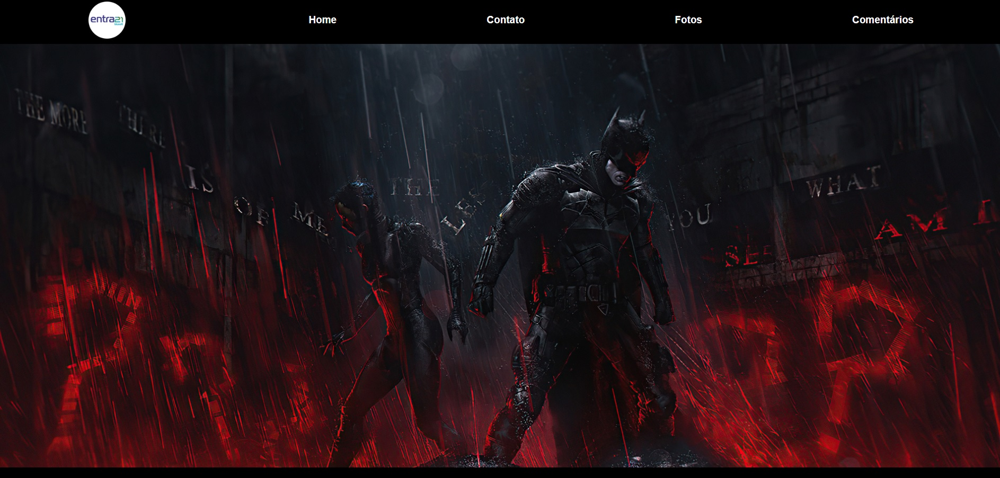

<h1 align="center">  Page do Filme Batman. </h1>

Projeto Web - Site com atores do filme e venda de ingresso para o filme do Batman.

  <a href="#-tecnologias">Tecnologias</a>&nbsp;&nbsp;&nbsp;|&nbsp;&nbsp;&nbsp;
  <a href="#-projeto">Projeto</a>&nbsp;&nbsp;&nbsp;&nbsp;&nbsp;&nbsp;  

  

## 🚀 Tecnologias

Esse projeto foi desenvolvido com as seguintes tecnologias:

- HTML5 e CSS3;
- Git e Github;

## 💻 Projeto

O site é um projeto que mostra a flexibilidade para pessoas que buscam mais facilidade e eficiência em um site, tornando assim os pedido e solicitações mais ágeis e precisa através de uma página leve fácil acesso.

Desenvoldido por: [Wagner Ferreira](https://www.instagram.com/wagnerffadm/);# Senai-projeto-site
